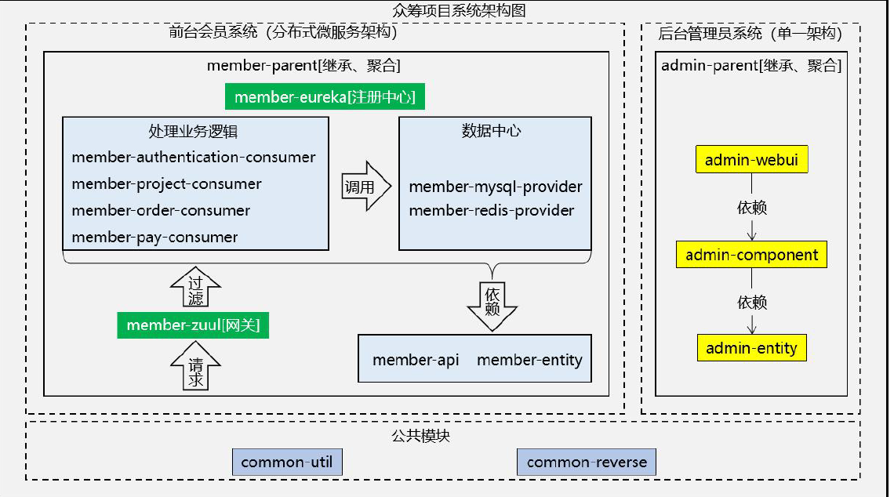
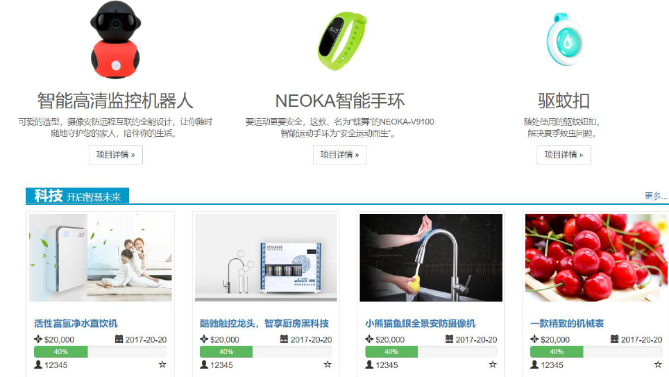
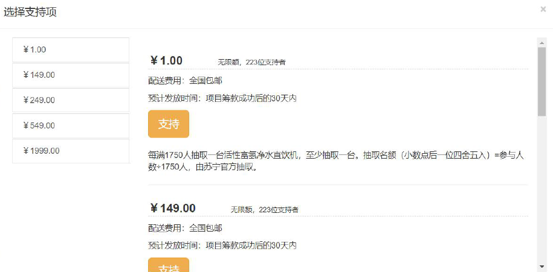
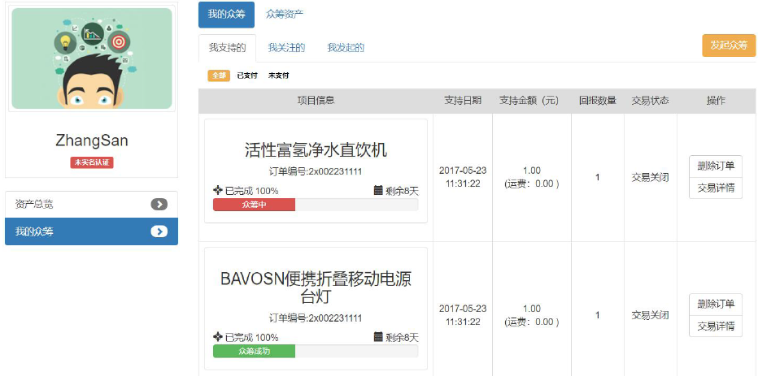
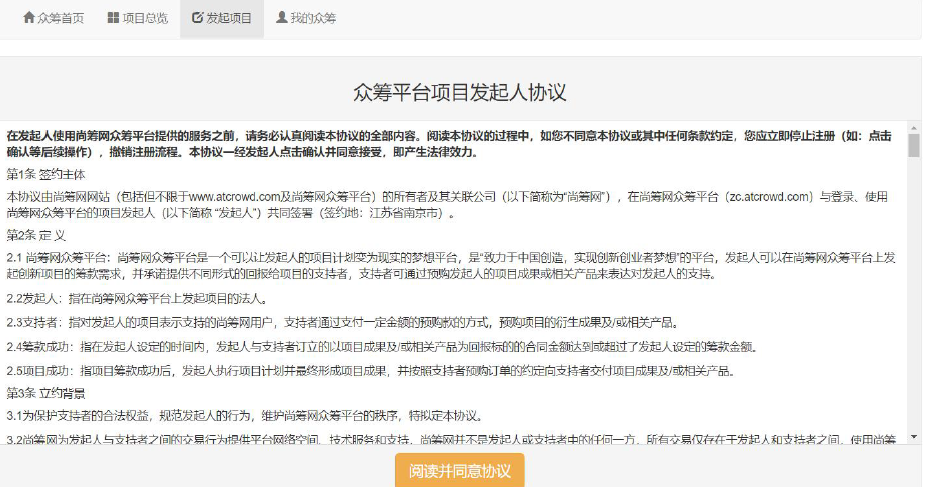
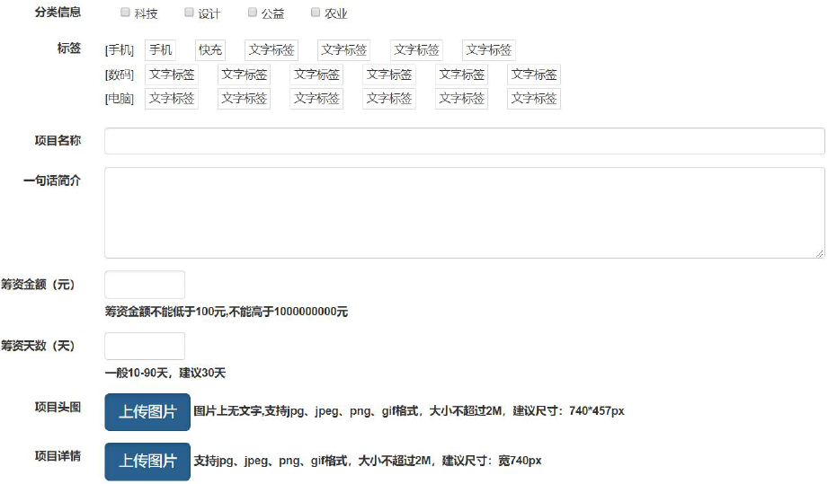
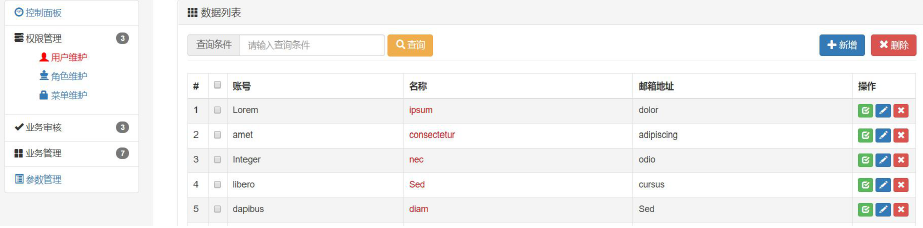
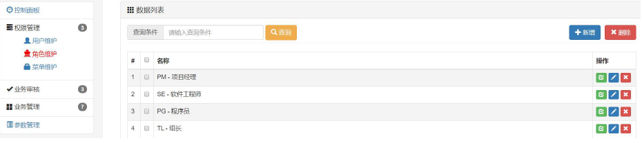
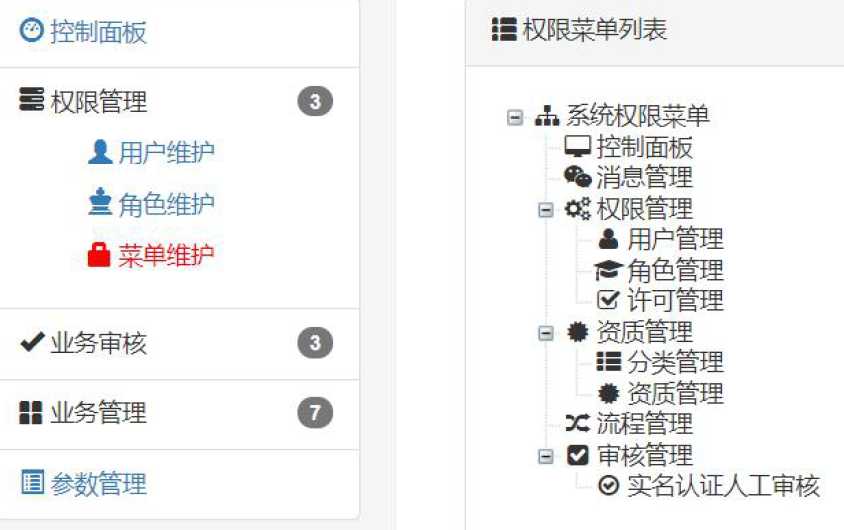

### 项目介绍

* 该项目采用了两种不同的架构进行开发，其中后台管理员系统使用单一架构开发,前台会员系统使用分布式架构开发
* 该项目主要目的是为了帮助创业者发布创业项目、向大众募集启动资金的融资平台

### 项目搭建环境

* mysql 5.6 
* java开发工具IDEA
* redis
* 阿里云面向对象存储服务OOS
* 框架：SSM SpringCloud
* 支付宝开发者接口
* 阿里云短信接口

### 项目架构

### 项目展示

* 众筹项目展示

* 众筹项目细节展示

* 项目支持

* 个人中心

* 发起众筹

* 管理员功能

